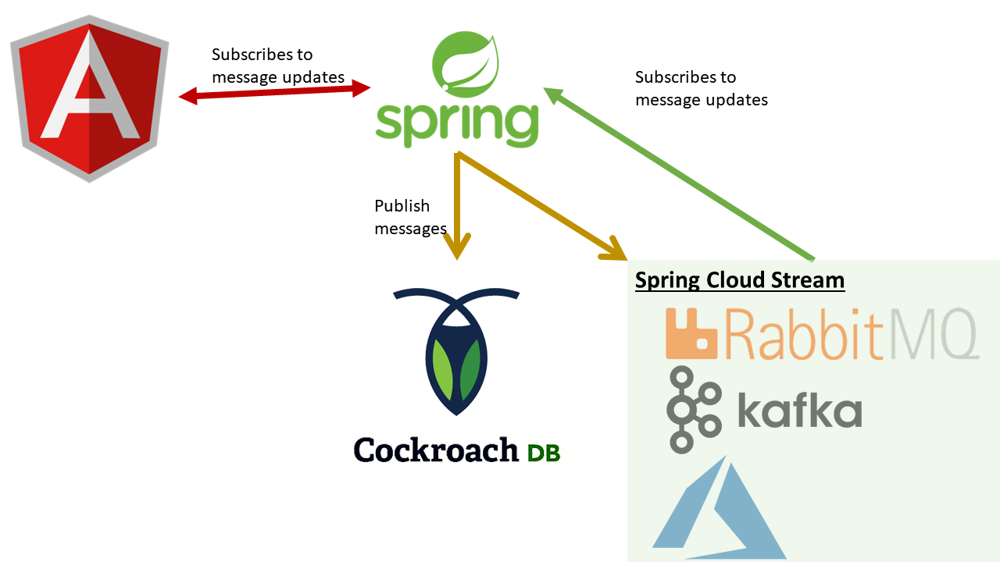

# spring-cloud-stream
Poc to show how to use spring reactive web with cockroach db in a chat application
## Diagram

## to run backend
backend/spring-boot:run
## to run frontend
(once) npm install  
ng serve  

## to run coackroach (on docker)
<imageid = docker image ls  
docker container run -p 26257:26257 -p 18080:8080 <imageid> start --insecure  

## run RabbitMQ ( on docker)
docker run -d -p 15672:15672 -p 5672:5672 -p 5671:5671 --hostname my-rabbitmq --name my-rabbitmq-container  rabbitmq:3-management

## run Kafka
### if needed
this will be harder due to the way kafka cluster is set up. spring app needs to be ran in the same network...  
not so good for localhost tryouts

docker swarm init
(needed ? ) docker network create -d overlay --attachable kafka-net
/spring-cloud-stream/deploy/kafka# docker stack deploy --compose-file=docker-compose.yml kafka

#### Management endpoint
http://localhost:15672/

### Backend startup
If a valid connection to coackroach database exists, than the app will make sure the chat_message table exists

### Limitations
Currently using a UnicastProcessor to allow pushing messages to frontend. 
In a distributed architecture, this will not work.
A message queue or other kind of publisher should we used